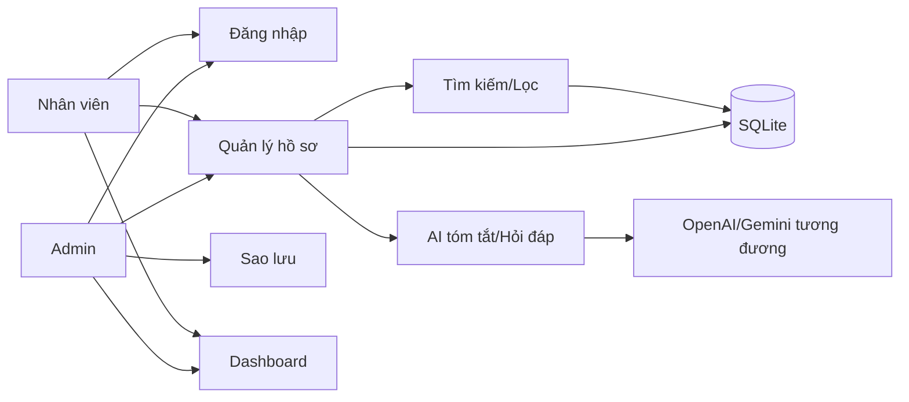

# 4. Actor & Use Case
## Actor
- Admin
- Nhân viên
- AI Service (hệ thống ngoài)
## Use Case
UC01 Đăng nhập; UC02 Quản lý hồ sơ; UC03 Tìm kiếm/lọc; UC04 Dashboard; UC05 Cảnh báo; UC06 AI tóm tắt; UC07 AI hỏi đáp; UC08 Sao lưu.
## Quan hệ
Admin → UC01..UC08. Nhân viên → UC01..UC07. UC06/UC07 → AI Service. UC02/UC03/UC04/UC05 → Database.
## Sơ đồ dạng Mermaid

